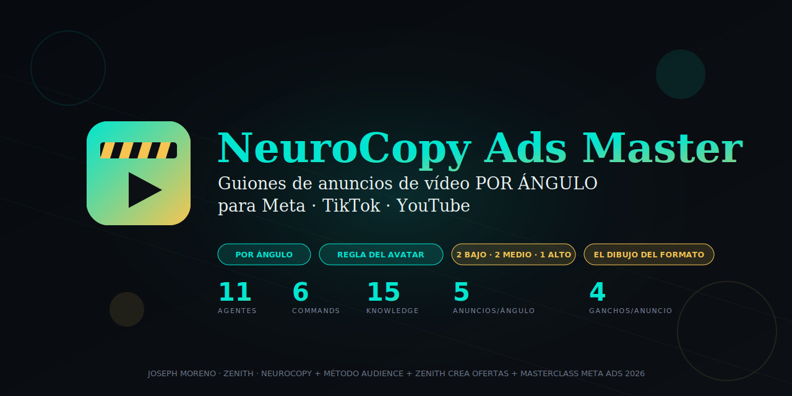
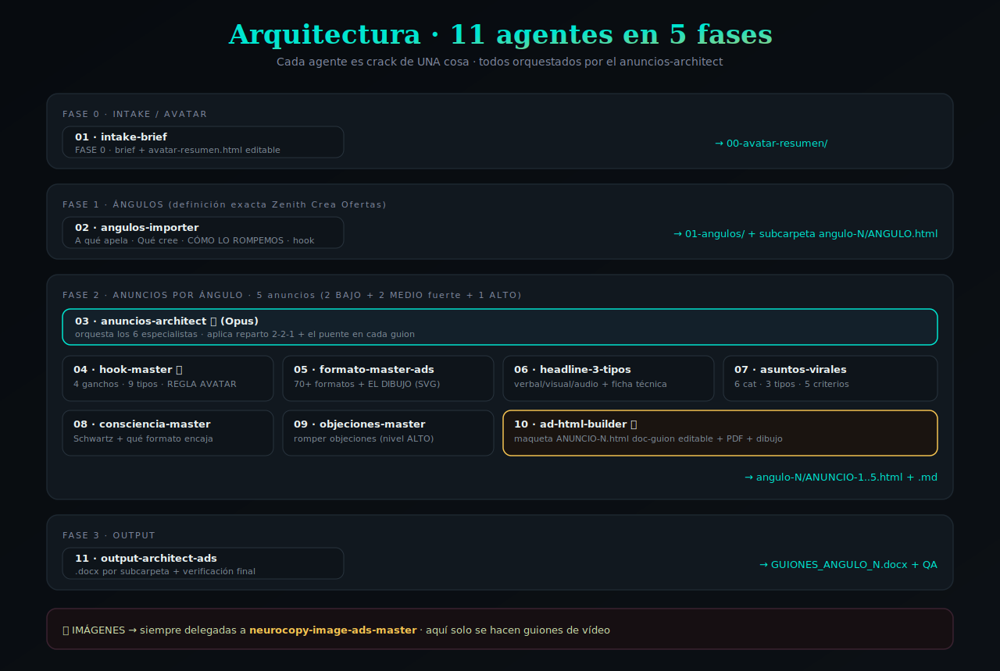
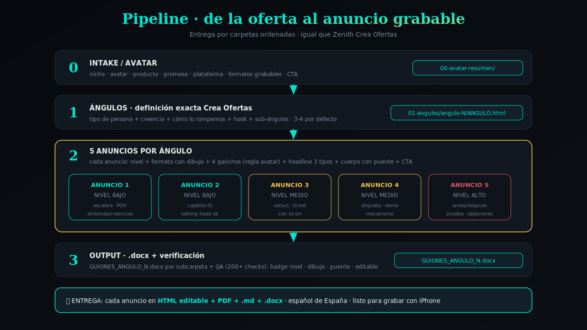

<div align="center">



# NeuroCopy Ads Master 🎯

### Sistema TOP 1% para crear ANUNCIOS de vídeo (guiones) POR ÁNGULO · Meta · TikTok · YouTube

**13 sub-agentes orquestados · 8 commands · 22 knowledge files · 70+ formatos + banco Zenith (~24) · 5 anuncios por ángulo (2-2-1) · 4 ganchos por anuncio · doc-guion HTML editable + PDF + .md + .docx**

[](https://opensource.org/licenses/MIT)
[](https://claude.com/claude-code)
[](https://github.com/zenithmetodo/neurocopy-ads-master)
[](#fuera-de-alcance)

**[INSTALAR](#instalación) · [EMPEZAR PASO A PASO](GETTING_STARTED.md) · [PIPELINE](#pipeline-de-uso) · [LA REGLA ESTRELLA](#-la-regla-estrella-el-avatar-en-el-gancho) · [LOS 13 SUB-AGENTES](#los-13-sub-agentes) · [ENTREGA POR CARPETAS](#entrega-por-carpetas)**

</div>

---

## ¿Qué es NeuroCopy Ads Master?

Un **mega-plugin de Claude Code** que hace **UNA sola cosa, brutalmente bien**: crear **guiones de anuncios de vídeo organizados POR ÁNGULO** para campañas de Meta, TikTok y YouTube.

> *"El creativo es la palanca. Meta solo distribuye. Por eso aquí solo hacemos anuncios de vídeo, brutales y diversos, por ángulo."*

Combina cuatro fuentes de ADN:

| Fuente | Qué aporta |
|---|---|
| **NeuroCopy** (skill original) | Niveles de consciencia (Schwartz), 3 cerebros, hooks rompescroll, objeciones, la regla del avatar |
| **Método Audience** (Elias Mamã · Zenith) | 70+ formatos + banco Zenith, headlines verbal/visual/audio, asuntos virales, ficha técnica, el doc-guion HTML |
| **Zenith Crea Ofertas** | La **definición exacta de ÁNGULO** (3 ingredientes) + entrega por carpetas |
| **Masterclass Meta Ads Creative Strategy 2026** | 9 tipos de gancho + 4 palancas + grading + el puente + diversidad creativa para Andromeda |

### El problema que resuelve

La mayoría escala campañas tocando presupuestos y públicos. Pero **el 80% del resultado está en el creativo**. El problema real es producir **muchos anuncios DISTINTOS** (no variaciones cosméticas) que ataquen **ángulos diferentes** y **niveles de consciencia distintos**, sin sonar a IA y sin inventar cifras.

### La solución

Por cada **ÁNGULO** → **5 anuncios** con reparto fijo **2 BAJO + 2 MEDIO fuerte + 1 ALTO**, cada uno con su **formato dibujado**, sus **4 ganchos** (regla del avatar), su **headline 3 tipos**, su **nivel de consciencia** y el **cuerpo palabra por palabra con puente** — entregado en **carpetas ordenadas** estilo Zenith Crea Ofertas.

---

## Arquitectura del sistema

<div align="center">

</div>

**13 sub-agentes en 5 fases.** El `anuncios-architect` orquesta a 6 especialistas y el `ad-html-builder` maqueta cada anuncio en un doc-guion HTML editable.

---

## Pipeline de uso

<div align="center">

</div>

```
0 · INTAKE/AVATAR  → intake-brief        → 00-avatar-resumen/
1 · ÁNGULOS        → angulos-importer    → 01-angulos/ + subcarpeta angulo-N/ANGULO.html
2 · ANUNCIOS/ÁNG.  → anuncios-architect  → 5 anuncios (2 BAJO + 2 MEDIO + 1 ALTO) por ángulo
       └─ orquesta: hook-master · formato-master-ads · headline-3-tipos · asuntos-virales · consciencia-master · objeciones-master
       └─ maqueta:  ad-html-builder
3 · OUTPUT         → output-architect-ads → GUIONES_ANGULO_N.docx + verificación
```

### Día tipo

```bash
/ads-master                 # pipeline completo: avatar → ángulos → anuncios por ángulo
# o por piezas:
/ads-angulo                 # trabaja/importa los ángulos (def. exacta Crea Ofertas)
/ads-anuncio [ángulo]       # los 5 anuncios de UN ángulo
/ads-hooks [anuncio]        # solo los 4 ganchos (regla del avatar)
/ads-formato [anuncio]      # recomienda formato + EL DIBUJO
/ads-headline [tema]        # headline 3 tipos + ficha técnica
```

---

## ⚠️ La regla estrella: EL AVATAR EN EL GANCHO

La regla más importante de todo el plugin. En **cada gancho** se llama al avatar (entrenador, embarazada, psicóloga, autónomo…) pero **en UNA sola capa**:

| Si el AUDIO… | …entonces el TEXTO OVERLAY… |
|---|---|
| **nombra al avatar** ("Si eres entrenador online…") | mete **CURIOSIDAD + ASUNTO VIRAL** (no repite el avatar) |
| **mete curiosidad** | el **OVERLAY nombra al avatar** |

**Nunca en las dos capas a la vez.** Si el audio ya dice el avatar y el overlay también → desperdicias una capa y matas la curiosidad.

```
❌ MAL:  AUDIO: "Entrenadores, esto os interesa"  ·  OVERLAY: "PARA ENTRENADORES"
✅ BIEN: AUDIO: "Entrenadores, esto os interesa"  ·  OVERLAY: "El error que te cuesta 8 clientes al mes"
✅ BIEN: AUDIO: "El error que te cuesta 8 clientes" ·  OVERLAY: "ENTRENADOR ONLINE 👇"
```

Detalle completo y obligatorio en [`knowledge/hooks/01-regla-avatar-gancho.md`](knowledge/hooks/01-regla-avatar-gancho.md).

---

## Las 6 reglas globales innegociables

Se aplican en **CADA anuncio**, sin excepción:

1. **POR ÁNGULO · 5 anuncios con reparto 2-2-1** → 2 NIVEL BAJO + 2 NIVEL MEDIO fuerte + 1 NIVEL ALTO. Cada anuncio hereda tipo de persona + creencia + cómo lo rompemos del ángulo y usa un formato distinto.
2. **4 GANCHOS por anuncio** → todos HOOKS (nunca CTA). Cada gancho = VISUAL + AUDIO + TEXTO OVERLAY + [CONTEXTO VISUAL] + ficha (asunto viral + estructura + 2 gatillos).
3. **REGLA DEL AVATAR EN EL GANCHO** → el avatar en una capa, curiosidad + asunto viral en la otra. Nunca duplicar.
4. **NIVELES DE CONSCIENCIA OBLIGATORIO** → cada anuncio declara su nivel (Schwartz) y qué formato + táctica encaja. Los niveles se mezclan (abre BAJO, sube).
5. **HEADLINE 3 TIPOS (PARA ADS) + FICHA TÉCNICA + FORMATO con dibujo + PUENTE** → el headline está al servicio del anuncio (construye los ganchos/overlays); el cuerpo lleva el puente (gancho → cuerpo gradual, sin saltos).
6. **ENTREGA por CARPETAS + HTML editable + PDF** → `00-avatar-resumen/`, `01-angulos/`, `01-angulos/angulo-N/`. Español de España, sin sonar a IA, sin inventar cifras.

---

## 🧠 Niveles de Consciencia (agente `consciencia-master`)

Cada anuncio se trabaja por **nivel de consciencia** (Eugene Schwartz). El reparto de 5 anuncios por ángulo está pensado para **cubrir todo el funnel**:

| Nivel | Anuncios | Qué CONECTA (lo que se habla) | Formatos que encajan |
|---|---|---|---|
| **BAJO (1-2)** | 2 anuncios | síntomas · creencias erróneas · dolor · "no hagas esto / haz esto" | escalera 5 niveles · cajetilla de pregunta IG · POV · talking-head |
| **MEDIO (3-4)** | 2 anuncios | el mecanismo · comparaciones (sobre todo CON vs SIN) · demostración | versus split · ticket · etiqueta nutricional · demo en pantalla |
| **ALTO (5)** | 1 anuncio | romper objeciones (precio/tiempo/miedo) · prueba social · mecanismo | antes/después · "sirve / no sirve" · demo del mecanismo |

> ⚠️ **Los niveles se MEZCLAN:** el anuncio abre en BAJO (para no perder a nadie) y sube. Los formatos **no están atados a un nivel** — cualquiera se escribe en BAJO/MEDIO/ALTO cambiando el ángulo. Detalle: [`knowledge/consciencia/niveles-consciencia.md`](knowledge/consciencia/niveles-consciencia.md).

---

## La definición exacta de ÁNGULO (Zenith Crea Ofertas)

Un ángulo = **una razón distinta de por qué me comprarían**. Tiene **3 ingredientes obligatorios**:

1. **Tipo concreto de persona** (no "todos": "entrenador online que ya factura pero no escala")
2. **Creencia específica** que tiene metida ("creo que necesito más clientes, no mejores sistemas")
3. **Reconocimiento + cómo lo rompemos** (el giro que le abre los ojos)

Cada `ANGULO.html` lleva los campos canónicos: **Nombre descriptivo · A qué apela · Quién es · Qué cree · CÓMO LO ROMPEMOS · Reconocimiento · Hook · sub-ángulos**. Detalle en [`knowledge/angulos/`](knowledge/angulos/).

---

## Los formatos · 70+ + banco Zenith + EL DIBUJO

El `formato-master-ads` elige de **70+ formatos** + el **banco Zenith (~24 disruptivos)** o **inventa uno nuevo pensando fuera de la caja**. Lo clave: **EL DIBUJO DEL FORMATO** — un componente visual HTML/SVG que el editor recrea para grabar:

🎫 ticket · 🏷️ etiqueta nutricional · 📈 monitor ECG · ⚽ alineación de fútbol · 🪜 escalera 5 niveles · 🗺️ mapa de metro · 🏢 organigrama · 💬 cajetilla de pregunta de IG · 🆚 versus split · 📊 ranking/tier list…

Si es lista/escalera/ranking → lleva **"DI →"** embebido en cada elemento (lo que dices al señalarlo). Conocimiento en [`knowledge/formatos/`](knowledge/formatos/).

---

## Headline 3 tipos + ficha técnica (agente `headline-3-tipos`)

El headline está **al servicio del ad** (sirve para construir los ganchos y overlays). Tres tipos alineados al mismo gatillo:

| Tipo | Es… | Alimenta… |
|---|---|---|
| **VERBAL** | lo que se DICE | el audio del gancho y del cuerpo |
| **VISUAL** | el texto en pantalla | el TEXTO OVERLAY |
| **AUDIO** | lo que se MUESTRA en el primer 0,5s | el primer frame / contexto visual |

Cada headline lleva su **ficha técnica obligatoria**: asuntos virales + estructura + gatillos + identificación del avatar. Detalle en [`knowledge/headlines/`](knowledge/headlines/).

---

## Los 9 tipos de gancho + 4 palancas + el puente

**4 palancas** de las que tira un gancho: **ángulo · oferta · avatar · formato**. **3 elementos** de cada gancho: visual · audio · overlay. **5 criterios** de grading. Y **el puente**: la transición suave del gancho al cuerpo (0-3s gancho → 3-15s el puente educa y baja la guardia → cuerpo → CTA). El producto se nombra **tarde**. Todo en [`knowledge/hooks/00-taxonomia-hooks.md`](knowledge/hooks/00-taxonomia-hooks.md) y [`knowledge/estrategia/creative-strategy-2026.md`](knowledge/estrategia/creative-strategy-2026.md).

---

## Los 13 sub-agentes

| # | Agente | Crack en… | Modelo |
|---|---|---|---|
| 01 | **intake-brief** | FASE 0 · avatar-resumen | Sonnet |
| 02 | **angulos-importer** | recibe/define los ángulos (def. exacta Crea Ofertas) | Sonnet |
| 03 | **anuncios-architect** ⭐ | 5 anuncios POR ángulo · orquesta todo | Opus |
| 04 | **hook-master** ⭐ | 4 ganchos · 9 tipos · 4 palancas · REGLA DEL AVATAR | Opus |
| 05 | **formato-master-ads** | 70+ formatos + banco Zenith + inventar + EL DIBUJO | Opus |
| 06 | **headline-3-tipos** | headline verbal/visual/audio + ficha técnica | Sonnet |
| 07 | **asuntos-virales** | asuntos virales (6 cat · 3 tipos · 5 criterios) + estructuras | Sonnet |
| 08 | **consciencia-master** | nivel Schwartz + qué formato/táctica encaja | Sonnet |
| 09 | **objeciones-master** | romper objeciones (nivel alto) | Sonnet |
| 10 | **ad-html-builder** ⭐ | maqueta cada anuncio (HTML doc-guion editable + PDF) | Opus |
| 11 | **output-architect-ads** | carpetas + .docx + verificación | Sonnet |

---

## Los 6 slash commands

| Command | Lanza |
|---|---|
| `/ads-master` | Entry point · pipeline completo (avatar → ángulos → anuncios por ángulo) |
| `/ads-angulo` | Trabaja/importa los ángulos (def. exacta) |
| `/ads-anuncio` | Crea los 5 anuncios de UN ángulo |
| `/ads-hooks` | Solo los 4 ganchos (regla del avatar) |
| `/ads-formato` | Recomienda formato + EL DIBUJO |
| `/ads-headline` | Headline 3 tipos + ficha técnica |

---

## Entrega por carpetas

Igual que Zenith Crea Ofertas crea una carpeta por etapa, aquí se entrega **siempre** en carpetas ordenadas:

```
proyecto-{cliente}-ads/
├── 00-avatar-resumen/
│   ├── avatar-resumen.html         (editable + PDF · quién es, dolores, deseos, objeciones, lenguaje real)
│   └── avatar-resumen.md
└── 01-angulos/
    ├── _indice-angulos.html        (vista general · todos los ángulos · editable + PDF)
    ├── angulos.json                (datos que consume el anuncios-architect)
    ├── angulo-1-[nombre]/
    │   ├── ANGULO.html             (explicación · def. exacta Crea Ofertas · editable + PDF)
    │   ├── ANUNCIO-1.html          (doc-guion · EL DIBUJO del formato · BAJO)
    │   ├── ANUNCIO-2.html          (BAJO)
    │   ├── ANUNCIO-3.html          (MEDIO fuerte)
    │   ├── ANUNCIO-4.html          (MEDIO fuerte)
    │   ├── ANUNCIO-5.html          (ALTO)
    │   ├── ANUNCIO-1.md … ANUNCIO-5.md
    │   └── GUIONES_ANGULO_1.docx   (los 5 guiones compilados para cliente)
    ├── angulo-2-[nombre]/ …
    └── angulo-N-[nombre]/ …
```

### Estructura de cada `ANUNCIO-N.html` (doc-guion editable)

Documento HTML autocontenido (paleta NeuroCopy: cian `#00E5D0` · gold `#f5c451` · dark `#0c1015`), **editable al clic** (contenteditable + autoguardado localStorage + Guardar PDF / Descargar copia / Restablecer) con `@media print`. Secciones en orden:

1. Cabecera · `ANUNCIO N · NEUROCOPY` + badge del formato
2. ⭐ **Badge nivel de consciencia** · BAJO / MEDIO / ALTO + táctica
3. **srcbox** · de qué ángulo sale (persona + creencia + cómo lo rompemos)
4. **formatbox** · el formato en 1 frase
5. ⭐ **EL DIBUJO DEL FORMATO** · el componente visual HTML/SVG
6. **Los 4 ganchos** · AUDIO + OVERLAY + VISUAL + [CONTEXTO] + ficha (regla del avatar)
7. ⭐ **CUERPO palabra por palabra** · guion literal beat a beat con timestamps + el puente
8. **Overlays** · tabla seg / texto
9. **CTA exacto** · solo aquí
10. foot.

Detalle completo en [`knowledge/entrega/sistema-carpetas.md`](knowledge/entrega/sistema-carpetas.md).

---

## Knowledge Library · 19 archivos

```
knowledge/
├── angulos/              definición exacta de ángulo (Crea Ofertas)
├── consciencia/          niveles Schwartz + qué formato encaja
├── formatos/             00-master 70+ · 01-savebait · 02-formatos-zenith-html (EL DIBUJO)
├── headlines/            3 tipos · ficha técnica obligatoria · plan batch
├── asuntos-virales/      6 categorías · 3 tipos · 5 criterios
├── hooks/                00-taxonomía (9 tipos + 4 palancas + el puente) · 01-REGLA DEL AVATAR
├── estrategia/           creative-strategy-2026 (masterclass Meta Ads)
├── objeciones/           romper objeciones (Hormozi · Cialdini · sesgos)
├── entrega/              sistema-carpetas
├── mecanismo/            ⭐ Biblia del Mecanismo + mapa pieza → anuncio (intake oferta OPCIONAL)
└── copy/                 ⭐ Biblia del Copy + mapa pieza → anuncio (CÓMO se escribe · respaldo siempre)
```

> **Mecanismo + Oferta (opcional):** si el usuario trae su oferta ya construida (de `zenith-crea-ofertas`), los anuncios colocan cada pieza (villano, causa raíz, nombre chicle, objeto brillante, mito de origen) en su sitio según `knowledge/mecanismo/00-mecanismo-en-los-anuncios.md`. Si no la tiene, los anuncios se crean igual a partir de los ángulos.

> **Biblia del Copy (respaldo de copy):** el CÓMO se escribe el anuncio para que convierta (el cuerpo vende el clic, PAS+Prueba, los 5 tipos de prueba, transferencia de credibilidad, Frankenstein, SECAR>EXPANDIR, la trinidad del titular, dimensionalización). Hermana de la Biblia del Mecanismo (el QUÉ). Excluye a propósito ángulos y formato (ya cubiertos). Mapa pieza → anuncio en `knowledge/copy/00-copy-en-los-anuncios.md`.

Cada knowledge internalizado en el system prompt de los agentes (estilo Custom GPT). Cero re-lectura en runtime.

---

## Instalación

NeuroCopy Ads Master es un **plugin de marketplace** de Claude Code: sus 13 sub-agentes se **orquestan** de verdad (la skill `ads-master` los lanza con la tool Agent). Cualquiera puede instalarlo así:

**Opción A · dentro de Claude Code** (recomendada · pégale esto a Claude):
```
/plugin marketplace add zenithmetodo/neurocopy-ads-master
/plugin install neurocopy-ads-master@neurocopy-ads-mp
```

**Opción B · terminal (CLI):**
```bash
claude plugin marketplace add zenithmetodo/neurocopy-ads-master
claude plugin install neurocopy-ads-master@neurocopy-ads-mp
```

Luego **reinicia Claude Code**. Para arrancar: di **"crea anuncios"** / **"neurocopy ads"** o usa `/ads-master`.

> **¿Por qué marketplace y no skill suelta?** Solo un plugin de marketplace registra sus `agents/` como **sub-agentes lanzables** (`neurocopy-ads-master:intake-brief`, `…:hook-master`, …). Instalado como skill, los agentes quedan inertes y todo se hace "en uno". Como plugin, la skill `ads-master` **los llama, los orquesta y compone** el resultado.

> **Memoria/tono:** si subes tu CLAUDE.md, tu doc de tono/voz de marca o tu memoria, el plugin los detecta y escribe TODO con TU voz. La **Biblia del Copy** (`knowledge/copy/biblia-del-copy.md`) es de lectura **obligatoria** para cada sub-agente.

📖 **¿Primera vez? Sigue la guía paso a paso:** [GETTING_STARTED.md](GETTING_STARTED.md)

---

## Fuera de alcance

- **Imágenes / creativos estáticos** → siempre a [`neurocopy-image-ads-master`](https://github.com/zenithmetodo/neurocopy-image-ads-master). Este plugin solo hace **guiones de vídeo**.
- Gestión de cuenta · media buying · presupuestos · públicos.
- **NO "conceptos"** → no se usa el framework "persona+ángulo+oferta" como entregable; se trabaja por ÁNGULOS.

---

## Hermanos de plugins

- **Zenith Crea Ofertas™** → crea la oferta de alto valor percibido (de ahí salen los ángulos).
- **Zenith Audience™** → contenido orgánico viral diario.
- **neurocopy-image-ads-master** → los creativos estáticos / imágenes de los ads.

---

## Atribución

**NeuroCopy Ads Master** · Joseph Moreno · Zenith · 2026. Conocimiento: skill original NeuroCopy + Método Audience (Elias Mamã · Marconi Rômulo) + definición de ángulo de Zenith Crea Ofertas + masterclass *Meta Ads Creative Strategy in 2026*. Imágenes → `neurocopy-image-ads-master`.

---

## License

MIT License · ver [LICENSE](LICENSE).

---

<div align="center">

**Construido por Joseph Moreno · Zenith · 2026**

[GitHub](https://github.com/zenithmetodo) · ⭐ **Si te ayuda, dale una estrella** ⭐

</div>
